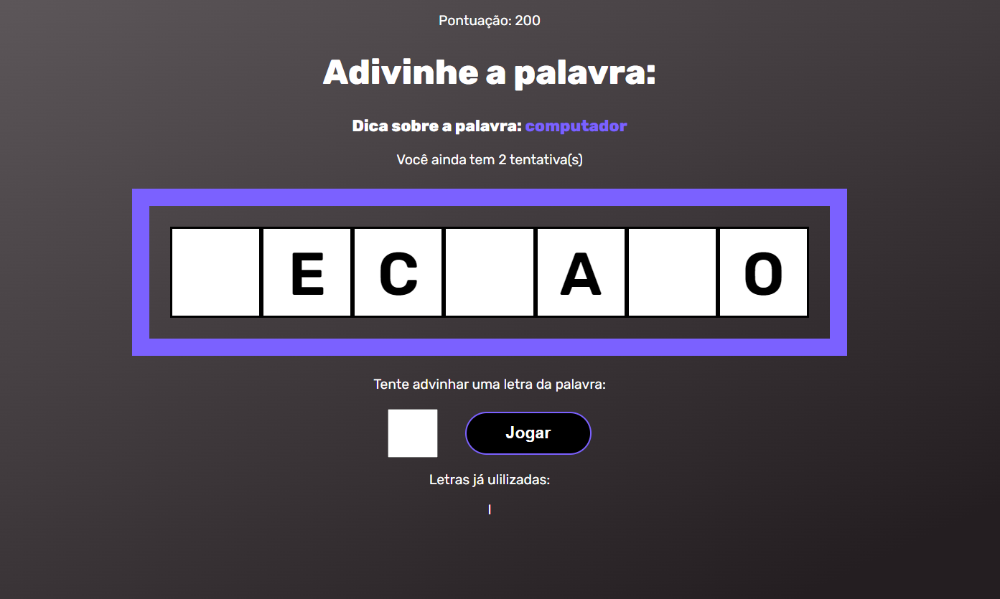

<h1 align="center">Secret Word</h1>

  <a href="#-tecnologias">Tecnologias</a>&nbsp;&nbsp;&nbsp;|&nbsp;&nbsp;&nbsp;
  <a href="#-projeto">Projeto</a>&nbsp;&nbsp;&nbsp;|&nbsp;&nbsp;&nbsp;
  <a href="#-layout">Layout</a>&nbsp;&nbsp;&nbsp;|&nbsp;&nbsp;&nbsp;

 

  

## 🚀 Tecnologias

Esse projeto foi desenvolvido com as seguintes tecnologias:

- HTML 
- CSS
- JavaScript
- React.JS
- Npm

## 💻 Projeto

Este projeto é um jogo de adivinhação de palavras, muito semelhante aos que são apresentados em programas de TV. Pude colocar em prática conceitos basilares de React.JS.

## 🔖 Layout

Você pode visualizar o layout do projeto através [DESSE LINK](https://secret-word-tawny.vercel.app/).
